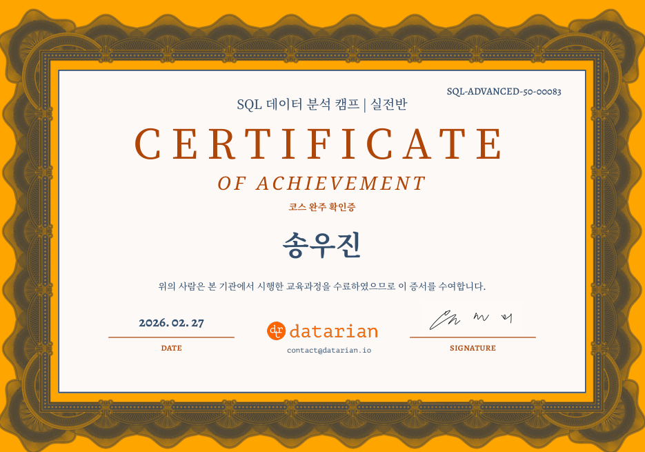

  <h1>👋 Hi, I'm WooJin Song</h1>
  <h3>Aspiring Data Analyst</h3>
  
🎓 Computer Science & Statistics | 📍 Hankuk University of Foreign Studies

  

    <a href="mailto:songwj326@gmail.com">📧 Email</a>
  

---

## 🧠 About Me
I am a student majoring in Computer Science and Statistics,  
with a strong interest in **Data Analysis** and **Machine Learning**.  

I enjoy working with data to extract meaningful insights and continuously improve my skills.

---

## 🛠️ Tech Stack

### 💻 Languages

### 📊 AI & Data

### 🖥️ Systems

---

## 🎯 Career Goal
I aim to become a **Data Analyst**,  
combining programming and statistical knowledge to solve real-world problems.

---

## 🏅 Certifications

---

## 🤝 Let's Connect
I’m always open to opportunities and collaboration!
